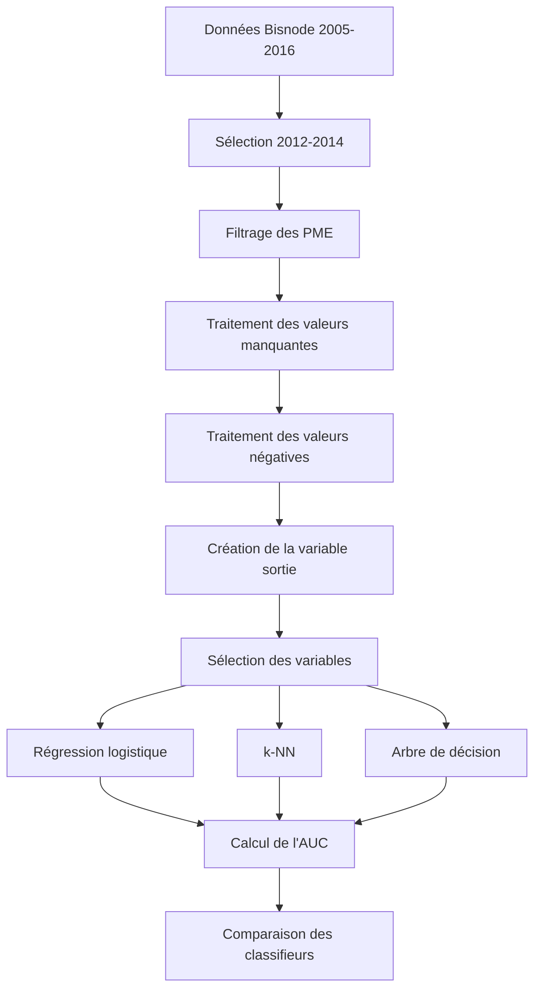

# Prédiction de la sortie des entreprises : probabilité et classification

<p align="center">
  
</p>


Projet académique de Data Science consacré à la prédiction de la sortie d’une petite ou moyenne entreprise à partir de ses informations comptables, financières et organisationnelles.

Le projet cherche à estimer la probabilité qu’une entreprise cesse son activité dans les deux années suivantes, puis à classer les entreprises entre :

```text
Entreprises susceptibles de rester en activité
Entreprises susceptibles de sortir
```

Trois méthodes de classification sont comparées :

1. régression logistique ;
2. k plus proches voisins, ou k-NN ;
3. arbre de décision.

La comparaison finale repose principalement sur l’aire sous la courbe ROC, ou AUC.

> Projet réalisé par Benjamin Baillet et Alexandra Millot dans le cadre du Master IREF de l’Université de Bordeaux.

---

## Sommaire

- [Contexte](#contexte)
- [Problématique](#problématique)
- [Objectifs](#objectifs)
- [Données](#données)
- [Population étudiée](#population-étudiée)
- [Variable cible](#variable-cible)
- [Architecture du projet](#architecture-du-projet)
- [Préparation des données](#préparation-des-données)
- [Traitement des valeurs manquantes](#traitement-des-valeurs-manquantes)
- [Traitement des valeurs négatives](#traitement-des-valeurs-négatives)
- [Déséquilibre de la cible](#déséquilibre-de-la-cible)
- [Sélection des variables](#sélection-des-variables)
- [Régression logistique](#régression-logistique)
- [k plus proches voisins](#k-plus-proches-voisins)
- [Arbre de décision](#arbre-de-décision)
- [Comparaison des modèles](#comparaison-des-modèles)
- [Résultats](#résultats)
- [Interprétation](#interprétation)
- [Compétences démontrées](#compétences-démontrées)
- [Limites](#limites)
- [Pistes d’amélioration](#pistes-damélioration)
- [Auteurs](#auteurs)

---

# Contexte

La disparition d’une entreprise peut avoir des conséquences importantes pour ses partenaires.

La probabilité qu’une entreprise reste en activité peut notamment intéresser :

- une banque étudiant une demande de crédit ;
- une entreprise sélectionnant un fournisseur ;
- un propriétaire souhaitant louer un local professionnel ;
- un investisseur évaluant une contrepartie ;
- un assureur étudiant un risque commercial.

Une banque doit, par exemple, évaluer si l’entreprise emprunteuse sera encore en activité au moment du remboursement du crédit.

Un fournisseur peut également souhaiter éviter une relation commerciale de long terme avec une entreprise présentant un risque élevé de sortie.

---

# Problématique

Le projet répond à la question suivante :

> Comment utiliser les informations comptables, financières et organisationnelles d’une PME afin d’estimer sa probabilité de sortie et de la classer comme entreprise susceptible de rester en activité ou de cesser son activité ?

La solution doit permettre de :

- sélectionner une population d’entreprises pertinente ;
- préparer les variables comptables ;
- construire une variable cible binaire ;
- estimer une probabilité de sortie ;
- tester plusieurs classifieurs ;
- mesurer leurs performances ;
- identifier le meilleur modèle avec l’AUC.

---

# Objectifs

Les principaux objectifs sont :

1. importer et comprendre la base Bisnode ;
2. sélectionner les entreprises correspondant au périmètre de l’étude ;
3. conserver les PME opérationnelles en 2012 ;
4. traiter les valeurs manquantes ;
5. traiter les valeurs comptables aberrantes ou négatives ;
6. construire la variable binaire `sortie` ;
7. sélectionner les variables explicatives pertinentes ;
8. entraîner une régression logistique ;
9. interpréter les coefficients du modèle ;
10. réaliser une sélection descendante des variables ;
11. entraîner un classifieur k-NN ;
12. entraîner des arbres de décision ;
13. calculer les matrices de confusion ;
14. comparer les modèles avec l’AUC ;
15. identifier le meilleur classifieur.

---

# Données

## Base originale

Le fichier utilisé est :

```text
original_bisnode_data.csv
```

La base initiale contient :

```text
287 829 observations
48 colonnes
Période couverte : 2005-2016
```

Les données décrivent plusieurs années d’activité pour un ensemble d’entreprises européennes appartenant notamment à des secteurs industriels et de services.

Les grandes entreprises réalisant plus de 10 millions d’euros de chiffre d’affaires annuel sont exclues de la source afin de protéger les données.

## Dictionnaire des variables

Le fichier :

```text
bisnode_variable_names.xls
```

contient les noms et descriptions des variables disponibles dans la base.

---

# Variables principales

Les variables initiales comprennent notamment :

| Variable | Description générale |
|---|---|
| `comp_id` | Identifiant de l’entreprise |
| `begin` | Début de la période comptable |
| `end` | Fin de la période comptable |
| `amort` | Amortissements |
| `curr_assets` | Actifs courants |
| `curr_liab` | Passifs courants |
| `fixed_assets` | Actifs immobilisés |
| `intang_assets` | Actifs incorporels |
| `inventories` | Stocks |
| `liq_assets` | Actifs liquides |
| `material_exp` | Charges de matières |
| `profit_loss_year` | Résultat annuel |
| `sales` | Chiffre d’affaires |
| `share_eq` | Capitaux propres |
| `subscribed_cap` | Capital souscrit |
| `tang_assets` | Actifs corporels |
| `wages` | Salaires |
| `ceo_count` | Nombre de dirigeants |
| `foreign` | Indicateur de propriété étrangère |
| `urban_m` | Catégorie géographique ou urbaine |
| `labor_avg` | Effectif ou travail moyen |
| `exit_year` | Année de sortie |
| `exit_date` | Date de sortie |

---

# Population étudiée

Le projet se concentre sur les petites et moyennes entreprises.

Les règles de sélection appliquées dans le notebook comprennent :

```text
Chiffre d’affaires inférieur à 10 millions d’euros
Chiffre d’affaires supérieur à 1 000 euros en 2012
Présence dans les données des années 2012, 2013 et 2014
```

Les entreprises présentant un chiffre d’affaires inférieur à 1 000 euros en 2012 sont considérées comme potentiellement non opérationnelles et sont écartées.

Après le nettoyage et les filtres réalisés dans le notebook, la base utilisée pour la modélisation contient :

```text
1 935 observations
23 colonnes, variable cible comprise
```

---

# Variable cible

La variable cible créée dans le notebook est :

```text
sortie
```

Elle prend les valeurs suivantes :

```text
sortie = 1 : l’entreprise est considérée comme sortie
sortie = 0 : l’entreprise est considérée comme restée en activité
```

La variable est construite à partir de :

```text
exit_date
exit_year
```

Le notebook identifie comme sorties les entreprises dont la date ou l’année de sortie se situe entre 2012 et 2014.

---

# Répartition de la cible

Après le traitement des données :

```text
135 entreprises sorties
1 800 entreprises non sorties
Total : 1 935 entreprises
```

Soit environ :

```text
7 % d’entreprises sorties
93 % d’entreprises non sorties
```

La classe `sortie = 1` est donc très minoritaire.

Cette situation doit être prise en compte lors de l’interprétation des métriques : une accuracy élevée peut être obtenue en prédisant presque toujours qu’une entreprise restera en activité.

---

# Architecture du projet



---

# Préparation des données

## Suppression des variables

Plusieurs variables sont retirées car elles ne sont pas utilisées pour la modélisation finale ou sont considérées comme redondantes.

Parmi les colonnes supprimées figurent notamment :

```text
end
COGS
finished_prod
ind
region_m
ind2
net_exp_sales
origin
net_dom_sales
gender
balsheet_notfullyear
balsheet_length
balsheet_flag
birth_year
inoffice_days
personnel_exp
```

D’autres variables sont supprimées après la sélection de la population :

```text
D
founded_year
founded_date
female
nace_main
begin
year
```

Les identifiants et variables utilisées uniquement pour créer la cible sont également retirés avant la modélisation :

```text
comp_id
exit_year
exit_date
```

---

# Traitement des valeurs manquantes

Le notebook recherche les valeurs manquantes dans les variables numériques sélectionnées.

Pour chaque colonne traitée :

1. la moyenne est calculée ;
2. les valeurs manquantes sont remplacées par cette moyenne.

Exemple de logique utilisée :

```python
mean_value = data[column].mean()

data[column].fillna(
    mean_value,
    inplace=True
)
```

Cette méthode permet de conserver les observations, mais elle peut réduire artificiellement la variabilité des variables.

---

# Traitement des valeurs négatives

Certaines variables comptables, comme les stocks ou le capital souscrit, ne devraient pas être négatives selon le cadre retenu dans l’exercice.

Dans le notebook original, les valeurs négatives des variables numériques sélectionnées sont remplacées par leur valeur absolue :

```python
data[column] = data[column].abs()
```

Un contrôle est ensuite réalisé afin de vérifier qu’il ne reste plus de valeurs négatives.

---

# Sélection des variables

## Modèle initial

La première régression logistique utilise 22 variables explicatives.

Le modèle initial obtient :

```text
Pseudo R² : 0,08566
Log-vraisemblance : -447,69
LLR p-value : 3,686 × 10⁻⁹
```

Toutes les variables ne sont cependant pas significatives.

---

## Backward Selection

Une procédure de sélection descendante est appliquée.

Le principe est le suivant :

1. entraîner le modèle avec toutes les variables ;
2. identifier la variable ayant la p-value la plus élevée ;
3. supprimer cette variable si sa p-value dépasse 5 % ;
4. réentraîner le modèle ;
5. répéter jusqu’à ne conserver que des variables significatives.

La sélection finale conserve 13 variables :

```text
amort
curr_assets
curr_liab
intang_assets
material_exp
profit_loss_year
sales
subscribed_cap
tang_assets
ceo_count
foreign
urban_m
labor_avg
```

---

# Régression logistique

## Principe

La régression logistique estime la probabilité qu’une entreprise appartienne à la classe `sortie = 1`.

```math
P(sortie=1|X)
=
\frac{1}
{1+e^{-(\beta_0+\beta_1X_1+\cdots+\beta_pX_p)}}
```

Un coefficient positif augmente les log-odds de sortie.

Un coefficient négatif les réduit.

---

## Résultats du modèle sélectionné

Le modèle final obtient :

```text
Pseudo R² : 0,07920
Log-vraisemblance : -450,85
LLR p-value : 3,173 × 10⁻¹¹
```

Les 13 variables conservées possèdent une p-value inférieure à 5 % dans le modèle final.

## Variables associées positivement à la sortie

Les coefficients positifs comprennent notamment :

- `curr_assets` ;
- `intang_assets` ;
- `sales` ;
- `subscribed_cap` ;
- `tang_assets` ;
- `ceo_count` ;
- `foreign`.

Dans le cadre du modèle estimé, leur augmentation est associée à une hausse des log-odds de sortie, toutes choses égales par ailleurs.

## Variables associées négativement à la sortie

Les coefficients négatifs comprennent notamment :

- `amort` ;
- `curr_liab` ;
- `material_exp` ;
- `profit_loss_year` ;
- `urban_m` ;
- `labor_avg`.

Ces relations sont statistiques et ne doivent pas être automatiquement interprétées comme des relations causales.

---

## Prédiction

Les données sont séparées en :

```text
80 % pour l’entraînement
20 % pour le test
```

Avec un seuil de décision de 0,5, la matrice de confusion obtenue dans le notebook est :

```text
[[364, 0],
 [21,  2]]
```

L’accuracy est :

```text
94,57 %
```

Le modèle classe correctement la majorité des entreprises non sorties, mais ne détecte que 2 entreprises sorties sur 23 dans cet échantillon de test.

L’accuracy élevée est donc fortement influencée par le déséquilibre des classes.

---

# k plus proches voisins

## Principe

Le k-NN classe une observation en fonction des classes de ses voisins les plus proches.

Les variables sont d’abord standardisées afin de les placer sur des échelles comparables.

```python
X_train_z = X_train.apply(
    lambda x:
        (x - x.mean()) / x.std()
)
```

Plusieurs valeurs impaires de `k` comprises entre 1 et 31 sont comparées avec une courbe d’erreur.

La valeur retenue est :

```text
k = 7
```

---

## Résultats du k-NN

La matrice de confusion est :

```text
[[358, 6],
 [22,  1]]
```

Les résultats comprennent :

```text
Accuracy : 92,76 %
Précision de la classe sortie : 14 %
Rappel de la classe sortie : 4 %
F1-score de la classe sortie : 7 %
```

Le modèle classe correctement la plupart des entreprises restant en activité, mais détecte difficilement les entreprises sortantes.

Son AUC reste toutefois la meilleure parmi les trois méthodes comparées.

---

# Arbre de décision

Deux critères de séparation sont étudiés :

```text
Indice de Gini
Entropie
```

Les principaux paramètres utilisés sont :

```text
Profondeur maximale : 2
Nombre minimal d’observations par feuille : 5
```

## Arbre avec indice de Gini

La matrice de confusion présentée dans le notebook est :

```text
[[361, 0],
 [24,  2]]
```

Résultats :

```text
Accuracy : 93,80 %
Rappel de la classe sortie : 8 %
```

## Arbre avec entropie

La matrice de confusion est :

```text
[[361, 0],
 [26,  0]]
```

Résultats :

```text
Accuracy : 93,28 %
Rappel de la classe sortie : 0 %
```

L’arbre utilisant l’entropie ne détecte aucune entreprise sortante dans cet échantillon.

---

# Comparaison des modèles

La métrique principale utilisée est l’AUC.

L’AUC mesure la capacité d’un classifieur à classer une entreprise sortante au-dessus d’une entreprise non sortante pour différents seuils de décision.

Interprétation générale :

```text
AUC = 0,5 : modèle non discriminant
AUC proche de 1 : très forte capacité de discrimination
```

## Résultats

| Modèle | AUC |
|---|---:|
| Régression logistique | 0,6722 |
| k-NN | **0,7325** |
| Arbre de décision — Gini | 0,6262 |

## Classement

```text
1. k-NN
2. Régression logistique
3. Arbre de décision
```

Le meilleur modèle selon l’AUC calculée dans le notebook est donc :

```text
k-NN
```

avec :

```text
AUC = 0,7325
```

---

# Résultats principaux

- base initiale de 287 829 observations ;
- sélection d’un échantillon de PME ;
- base finale de 1 935 observations ;
- 135 entreprises sortantes ;
- sélection de 13 variables avec une procédure descendante ;
- régression logistique significative globalement ;
- comparaison de trois classifieurs ;
- meilleure AUC obtenue par le k-NN ;
- forte influence du déséquilibre de la cible ;
- faible rappel de la classe minoritaire pour les trois modèles.

---

# Interprétation

Le résultat principal ne doit pas être résumé uniquement par l’accuracy.

Avec environ 93 % d’entreprises non sorties, un classifieur peut atteindre une accuracy proche de 93 % en prédisant toujours la classe majoritaire.

L’AUC apporte une lecture plus utile de la capacité de classement, mais elle doit être complétée par :

- le rappel de la classe sortante ;
- la précision ;
- le F1-score ;
- la matrice de confusion ;
- la courbe Precision-Recall ;
- le coût économique des erreurs.

Dans une application bancaire, ne pas détecter une entreprise susceptible de sortir peut être beaucoup plus coûteux que classer à tort une entreprise saine comme risquée.

---

# Compétences démontrées

## Data Analysis

- importation de données volumineuses ;
- filtrage d’une population ;
- traitement des valeurs manquantes ;
- contrôle des valeurs négatives ;
- construction d’une variable cible ;
- analyse du déséquilibre.

## Statistiques

- régression logistique ;
- significativité des coefficients ;
- p-values ;
- pseudo R² ;
- sélection descendante ;
- interprétation des signes.

## Machine Learning

- apprentissage supervisé ;
- k-NN ;
- arbre de décision ;
- standardisation ;
- séparation train-test ;
- classification binaire.

## Évaluation

- accuracy ;
- précision ;
- rappel ;
- F1-score ;
- matrice de confusion ;
- courbe ROC ;
- AUC.

## Risque d’entreprise

- probabilité de sortie ;
- données comptables ;
- analyse de solvabilité ;
- classification des PME ;
- aide à la décision.

---

# Limites

- La classe des entreprises sortantes est très minoritaire.
- L’accuracy est donc peu informative lorsqu’elle est utilisée seule.
- Le rappel de la classe sortante est faible pour les trois modèles.
- Aucun rééquilibrage des classes n’est appliqué.
- Les valeurs manquantes sont imputées par la moyenne.
- Le remplacement des valeurs négatives par leur valeur absolue n’est pas économiquement neutre.
- Certaines valeurs négatives peuvent avoir une signification comptable réelle.
- La standardisation du train et du test est effectuée séparément dans le notebook original.
- Les splits ne sont pas toujours identiques entre les modèles.
- L’arbre de décision ne possède pas toujours un `random_state` fixe.
- L’AUC de la régression logistique est calculée sur l’ensemble complet dans la comparaison finale.
- Les AUC ne sont donc pas toutes calculées selon un protocole parfaitement homogène.
- Aucune validation croisée commune aux trois modèles n’est réalisée.
- Aucun calibrage des probabilités n’est étudié.
- Aucun coût économique des erreurs n’est intégré.
- Les modèles ne constituent pas des outils directement utilisables pour une décision bancaire réelle.

---

# Pistes d’amélioration

- utiliser un split stratifié ;
- appliquer une validation croisée stratifiée ;
- comparer les modèles sur les mêmes folds ;
- calculer toutes les métriques sur un jeu de test commun ;
- utiliser `class_weight="balanced"` ;
- tester SMOTE ;
- tester l’undersampling ;
- optimiser le seuil de décision ;
- privilégier le rappel de la classe sortante ;
- utiliser la courbe Precision-Recall ;
- tester Random Forest ;
- tester Gradient Boosting ;
- tester XGBoost ;
- optimiser les hyperparamètres ;
- utiliser un Pipeline Scikit-learn ;
- imputer uniquement sur le jeu d’entraînement ;
- appliquer le même scaler au train et au test ;
- analyser les coefficients avec des odds ratios ;
- créer des ratios financiers ;
- ajouter une matrice de coûts ;
- utiliser SHAP pour l’interprétabilité ;
- suivre les performances dans le temps.

---

# Conclusion

Ce projet met en œuvre une chaîne complète de classification :

```text
Données comptables
        ↓
Sélection des PME
        ↓
Nettoyage des variables
        ↓
Création de la cible
        ↓
Sélection des prédicteurs
        ↓
Régression logistique
        ↓
k-NN
        ↓
Arbre de décision
        ↓
Comparaison par AUC
```

Le k-NN obtient la meilleure AUC :

```text
0,7325
```

Il présente donc la meilleure capacité de classement parmi les trois modèles comparés dans le notebook.

Les résultats mettent cependant en évidence une difficulté majeure : la détection des entreprises sortantes reste faible à cause du déséquilibre important de la cible.

Le projet constitue ainsi une base solide pour une version plus avancée intégrant :

- rééquilibrage des classes ;
- validation croisée homogène ;
- optimisation des seuils ;
- métriques adaptées à la classe minoritaire ;
- modèles d’ensemble plus performants.

---

# Auteurs

Projet réalisé par :

- Benjamin Baillet ;
- Alexandra Millot.

Établissement :

```text
Université de Bordeaux
Master IREF
```

## Benjamin Baillet

Compétences principales :

- Python ;
- Pandas ;
- statistiques ;
- régression logistique ;
- Machine Learning ;
- gestion des risques ;
- SQL ;
- Power BI ;
- R.
